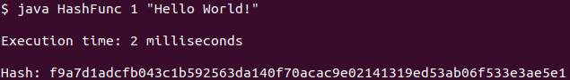
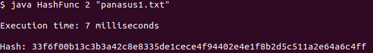
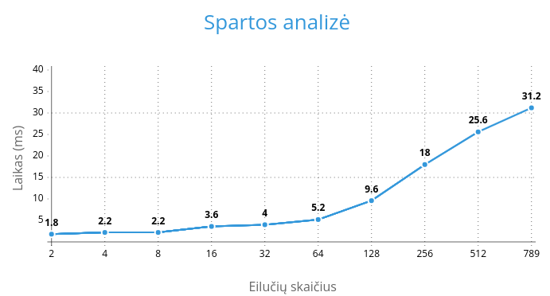

# Blokų grandinių technologijos
<h1>v0.1</h1>
<b>Pirma užduotis buvo sukurti savo maišos("hash") funkciją, kuri atitiktų reikalavimus:</b>

* Būtų deterministinė

* Su tuo pačiu input visada toks pat output

* Output visada turi būti vienodo dydžio

* Maišos funkcija apskaičiuojama greitai/efektyviai

* Iš hash'o funkcijos praktiškai neįmanoma atgaminti pradinių duomenų

* Atspari kolizijai

* Bent minimaliai pakeitus įvedimą turi smarkiai keistis output
<br>


*Hash'avimo pavyzdys per komandinę eilutę (Vartotojas pats įveda žinutę)*


*Hash'avimo pavyzdys per komandinę eilutę (Nuskaitomas failas)*


<h2>Hash funkcijos pseudo kodas:</h2>

```

1. Sukuriamas tuščias 256bit'ų String'as (visos reikšmės nuliukai)

2. Gaunama vartotojo įvestis(Nuskaitomas failas arba įvedama programos vykdymo metu)

3. Tikrinama ar įvesties simboliai yra ASCII lentelėje. Jeigu nėra - supaprastina į artimiausią
   reikšmę, kad priklausytų ASCII lentelėje

4. Sukuriamas "Salt":
   - Imamas kiekvienas pradinės įvesties simbolis (iki pirmųjų 10-ies simbolių)
     - Gaunama simbolio ASCII vertė
     - Ši ASCII vertė yra pridedama prie "Salt" reikšmės
     - Iš praeitai gautos ASCII vertės yra imamas kiekvienas simbolis
       - Gaunama to atskiro simbolio ASCII vertė
       - Ši ASCII vertė pridedama vėl prie "Salt" reikšmės
         - Šis procesas pakartojamas gilyn 3-ią kartą

5. "Druska" pridedama prie pradinės įvesties

6. Vykdomas "žinutės" hash'avimas:
   - Imamas kiekvienas "žinutės" simbolis atskirai
   - Gaunama simbolio ASCII vertė
   - Imamas 256bit'ų Stringo indeksas pagal ASCII vertę:
     - Jei bitas yra 0 tai pakeičiamas į 1 ir atvirkščiai
   - Visi dvejetainiai bit'ai yra stumiami/perkeliami į dešinę pagal simbolio ASCII vertę

7. Dvejetainės eilutės String'as konvertuojamas į šešioliktainę

```

<h2> Eksperimentiniai tyrimai</h2>

1. Įsitikinti, kad hash funkcija nepriklausomai nuo Input'o, Output'ai visada yra vienodo dydžio, o to paties failo hash'as yra tas pats (deterministiškumas).
   
   * Bent du failai būtų sudaryti tik iš vieno, tačiau skirtingo, simbolio.
   * Bent du failai būtų sudaryti iš daug (> 1000) atsitiktinai sugeneruotų simbolių.
   * Bent du failai būtų sudaryti iš daug (> 1000) simbolių, bet skirtųsi vienas nuo kito tik vienu (pvz. vidurinėje pozicijoje esančiu) simboliu.
   * Tuščio failo.

<b>Analizė:</b> <i>Maišos funkcija susidorojo su šiomis užduotimis. Vienas skirtingas simbolis pateikė visiškai skirtingą hash. Hash tokiam pačiam įvedimui visada vienodas. Iš pradžių tuščiam failui negeneravo hash, bet ši klaida buvo ištaisyta.</i>

----------------------------------------------------------------------------------

2. Pagal konstitucija.txt failą atlikti spartos analizę:
   
   * Patikrinti kiek laiko hash'uos 2eilutes, vėliau 4eilutes, 8 ir t.t.
  
<b>Analizė:</b> <i>Iš pradžių buvo problema, kad tekste yra lietuviškos raidės, nes jų nėra ASCII lentelėje. Šią problemą sutvarkiau konvertuodamas raides kaip č į c ar ę į e, taip galėdamas vėl naudotis ASCII lentele. Su greičiu problemų nebuvo, maišos funkcija apskaičiuojama greitai, nepriklausomai nuo eilučių kiekio.</i>



----------------------------------------------------------------------------------

3. Patikrinti ar su dideliu duomenų kiekiu hash'ų reikšmė nesutampa:
   
    * Sugeneruoti 100tūkst. String porų, kur porų String ilgis vienodas, bet pats turinys yra atsitiktinis
  (String ilgiai nuo 10simbolių iki 1000)
  
<b>Analizė:</b> <i>Galutinis rezultatas: 0 pasikartojimų, 100tūkst. nepasikartojimų. Tai reiškia, kad nuskaitant faile String poras nebuvo dviejų vienodų hash reikšmių.</i>

----------------------------------------------------------------------------------

4. Patikrinti ar su dideliu panašių duomenų kiekiu  hash'ų reikšmė nesutampa:
   
   * Eksperimentas panašus kaip ir 3. bet skiriasi, kad visos String poros skiriasi tik 1-u simboliu
   * Taip pat patikrinti kiek procentaliai reikšmės skiriasi bit'ų ir hex'ų lygmenyje
   * Pateikti minimalią, maksimalią ir vidutines procentines reikšmes
  
<b>Analizė:</b> <i>Maišos funkcijai ši užduotis sekėsi sunkiau. Buvo labai daug hash'ų pasikartojimų ( net 66proc. )

Bit'ų lygmenyje rezultatai: MIN - 0proc. MAX - 69proc. AVG - 15.09proc.

Hex'ų lygmenyje rezultatai: MIN - 0proc. MAX - 100proc. AVG - 27.67proc.</i>

 * MIN 0 - reiškia, kad du hash'ai yra vienodi

 * MAX 100 - reiškia, kad du hash'ai yra visiškai skirtingi, nėra nei vieno vienodo elemento

 * AVG - kuo mažesnis skaičius, tuo reiškias panašesni yra hash'ai

<h2>Galutinės išvados</h2>

<i> Maišos funkcija yra veikianti ir gan neblogai atlieka savo darbą. Bet yra vietų, kur reikia patobulinti. Tai ypač pasireiškia, kai imamas didelis duomenų kiekis ir poros skiriasi tik vienu simboliu. Vieną silpnumą įvardinčiau, kad bandant kurti šią funkciją nebuvo pasitelktos įvairios matematinės formulės. Buvo bandoma "maišyti" viską kiek galima daugiau, kad tas hash gautųsi kuo labiau atsitiktinesnis</i>