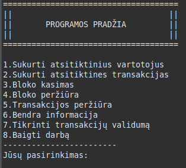

# Blokų grandinių technologijos
<h1>V0.2 BLOCKCHAIN</h1>
<b>Antra užduotis: supaprastintos blokų grandinės (blockchain) kūrimas</b>

Ši programa leidžia generuoti vartotojus, transakcijas ir kasti naujus blokus. Leidžia tikrinti transakcijų validumą, patogiai tikrinti visą blockchain
informaciją. Prieš bloko kūrimą yra sukuriami kandidatai, iš kurių vienas blokas bus iškastas. Visas blockchain veikia ir yra išsaugomas programos gyvavimo
metu, tai reiškia, kad išjungus programą visi duomenys išsitrins.

### Veikimo Principas

1. **Vartotojų Generavimas**
   - Vartotojas gali bet kuriuo programos metu pasirinkti kiek jis nori sukurti atsitiktinių vartotojų. Šie vartotojai turės private, public raktus, vardą, bei atsitiktinai sugeneruotą išankstinį balansą.

2. **Transakcijų Generavimas**
   - Vartotojas taip pat bet kuriuo programos metu gali pradėti generuoti atsitiktines transakcijas. Joms generuoti būtina, kad programoje būtų vartotojų. Transakcijos yra kuriamos tarp atsitiktinių vartotojų ir su atsitiktine suma.

3. **Blokų Kasimas**
   - Programa ima iki 100-o skirtingų transakcijų iš transakcijų baseino ir juos įdeda į bloką. Kai blokas yra iškasamas, transakcijos yra patvirtinamos, vartotojų balansai atnaujinami bei tos transakcijos ištrinamos iš transakcijų baseino
   - Vykdomas PoW principu blokų kasimas.
   
4. **Dalykų Saugojimas**
   - Visi sukurti elementai, visos transakcijos, jų būsenos yra išsaugomos skirtinguose sąrašuose, klasėse.

5. **Peržiūra**
   - Vartotojas bet kuriuo metu gali tikrinti programos informaciją: kiek vartotojų, transakcijų, blokų yra.
   - Galima tikrinti visus blokus arba tik vieną. Taipogi net susirasti norimą transakciją ir ją pateikti konsolėje.
   
### Kaip naudotis
	
	 Išsisaugoti projektą patogioje vietoje ir paleisti programą. Konsolėje bus pateikta visa informacija ir tolimesni žingsniai ką daryti.

 